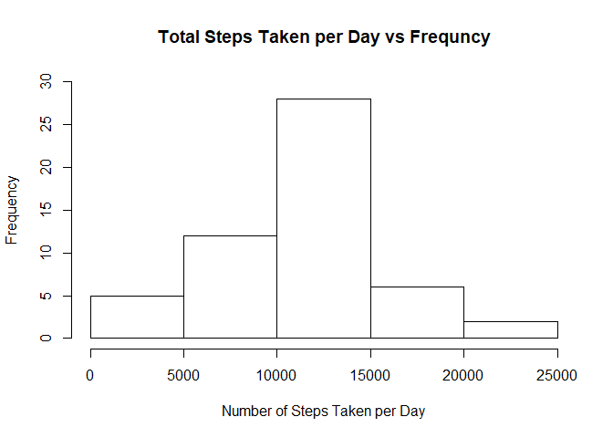
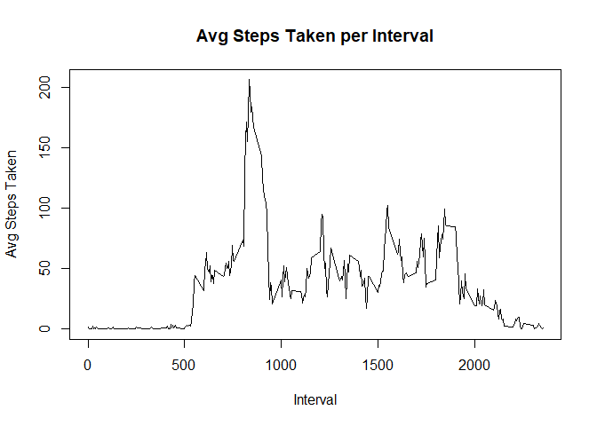
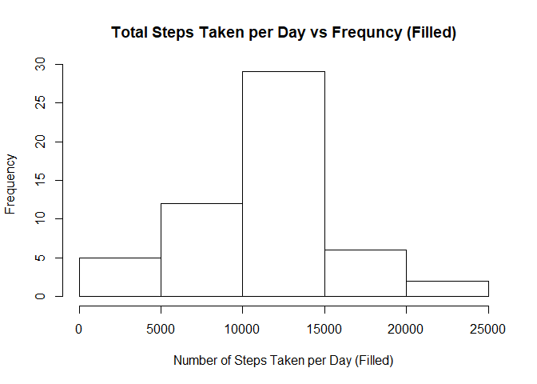
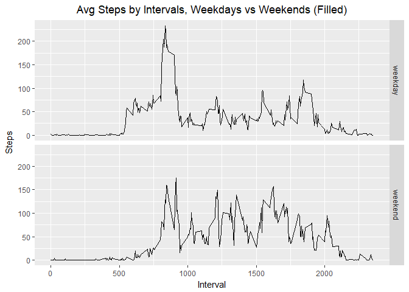

## Set global options for 'Knitr'

```r
library(knitr)
library(ggplot2)
Sys.setlocale("LC_ALL","English")
```

```
## [1] "LC_COLLATE=English_United States.1252;LC_CTYPE=English_United States.1252;LC_MONETARY=English_United States.1252;LC_NUMERIC=C;LC_TIME=English_United States.1252"
```

```r
opts_chunk$set(eval = TRUE, echo = TRUE)
```

## Loading and preprocessing the data

```r
unzip(zipfile = "activity.zip")
activity <- read.csv(file="activity.csv", sep=",", quote="\"")
```

## Activity data preview

```r
print(head(activity))
```

```
##   steps       date interval
## 1    NA 2012-10-01        0
## 2    NA 2012-10-01        5
## 3    NA 2012-10-01       10
## 4    NA 2012-10-01       15
## 5    NA 2012-10-01       20
## 6    NA 2012-10-01       25
```

## What is mean total number of steps taken per day?
### Total number of steps taken per day

```r
activityNoNA <- activity[!is.na(activity$steps),]
daySteps <- aggregate(steps ~ date, data=activityNoNA, FUN=sum)
```

### Histogram of the total number of steps taken each day

```r
hist(daySteps$steps, xlab = "Number of Steps Taken per Day", ylab="Frequency", main = "Total Steps Taken per Day vs Frequncy")
```

<!-- -->

### Mean and median of the total number of steps taken per day

```r
meanSteps = mean(daySteps$steps)
print(meanSteps)
```

```
## [1] 10766.19
```

```r
medianSteps = median(daySteps$steps)
print(medianSteps)
```

```
## [1] 10765
```

## What is the average daily activity pattern?
### Time series plot of average number of steps taken by intervals averaged across all days

```r
intervalSteps <- aggregate(steps ~ interval, data=activityNoNA, FUN=mean)
plot(x=intervalSteps$interval, y=intervalSteps$steps, type="l", xlab="Interval", ylab="Avg Steps Taken", main="Avg Steps Taken per Interval")
```

<!-- -->

### The interval that contains maximum number of steps

```r
maxInterval <- intervalSteps[order(-intervalSteps$steps),][[1]][1]
print(maxInterval)
```

```
## [1] 835
```

## Imputing missing values
### Total number of NA rows

```r
print(nrow(activity[rowSums(is.na(activity)) > 0,]))
```

```
## [1] 2304
```

### Filling in all NA values with means of that interval

```r
activityFill <- activity

## If steps is NA, the value will be replaced by mean of the corresponding interval, otherwise, it stays

activityFill$steps <- ifelse(is.na(activityFill$steps) == TRUE, intervalSteps[intervalSteps$interval == activityFill$interval, "steps"], activityFill$steps)
```

### Histogram of the total number of steps taken each day using filled activity data

```r
dayStepsFill <- aggregate(steps ~ date, data=activityFill, FUN=sum)
hist(x=dayStepsFill$steps, xlab = "Number of Steps Taken per Day (Filled)", ylab="Frequency", main = "Total Steps Taken per Day vs Frequncy (Filled)")
```

<!-- -->

### Mean and Median of the steps in  filled activity data per day

```r
meanStepsFill = mean(dayStepsFill$steps)
print(meanStepsFill)
```

```
## [1] 10766.19
```

```r
medianStepsFill = median(dayStepsFill$steps)
print(medianStepsFill)
```

```
## [1] 10765.59
```

### Impact of missing values

```r
## BF stands for before fill and AF stands for after fill
print(data.frame("Mean Steps BF" = meanSteps, "Median Steps BF" = medianSteps, "Mean Steps AF" = meanStepsFill, "Median Steps AF" = medianStepsFill))
```

```
##   Mean.Steps.BF Median.Steps.BF Mean.Steps.AF Median.Steps.AF
## 1      10766.19           10765      10766.19        10765.59
```

As we can see from the above stats, the mean and the median are exactly the same. This is because the filled values are pulled from the avg interval per day data that we have calculated earlier. When we recombine these intervals together, it will have no effects on the new mean and median values. Also the histograms above shows there is no difference between the two datasets.

## Are there differences in activity patterns between weekdays and weekends?
### Creating weekday & weekend factor

```r
activityFill$dayOfWeek <- sapply(activityFill$date, FUN=function(dateVal) {
  dateVal <- strptime(dateVal, format="%Y-%m-%d")
  
  if (weekdays(dateVal) %in% c("Monday","Tuesday","Wednesday","Thursday","Friday")){
    return("weekday")
  }
  else{
    return("weekend")
  }
})

activityFill$dayOfWeek <- as.factor(activityFill$dayOfWeek)
```


### Weekday vs Weekend patterns

```r
avgDayStepsFill <- aggregate(steps~interval+dayOfWeek, data=activityFill, FUN=mean)

ggplot(data=avgDayStepsFill ,aes(group=dayOfWeek)) + 
  geom_line(aes(x=interval, y=steps, color=dayOfWeek)) + 
  labs(x="Interval", y="Steps", title="Avg Steps by Intervals, Weekdays vs Weekends (Filled)", color=avgDayStepsFill$dayOfWeek) + 
  theme(plot.title = element_text(hjust = 0.5))
```

<!-- -->
